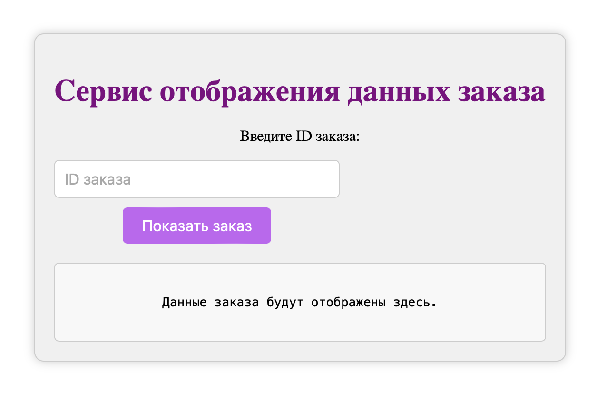
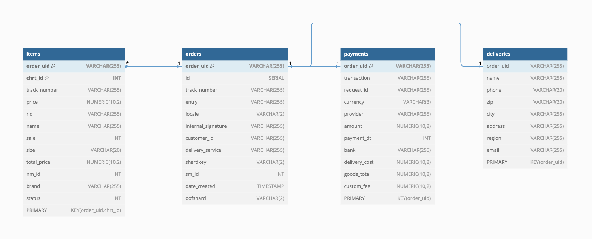

# Delivery-service
## Демонстрационный сервис, отображающий данные о заказах


Реализованы

1. Модели хранения данных по структуре из [файла](https://github.com/Basty64/delivery-service/blob/main/docs/model.json);
2. Веб интерфейс для доступа к заказам;
2. Хранение заказов в бд;
3. Кэширование заказов in memory;
4. Добавление и обработка новых заказов через nats-streaming;
5. Валидация входящих данных;
6. Деплой через docker и docker compose.

### Запуск:

При первом запуске:
```
docker compose up postgres
```
Затем:
```
docker compose up --build
```
> Использовался docker compose второй версии без retries и поэтому при первом запуске миграции не успевают накатываться до полного запуска постгреса.

При последующих запусках:
```
docker compose up
```

Публикация сообщений в nats:

Если подключаться из терминала:
```
docker exec -it delivery_service bash
```
Затем:
```
cd testing && go run publish-script.go
```

> Если подключаться к контейнеру из десктопной версии докера, то первая команда не нужна.

Завершение работы:
```
docker compose stop
```
Веб-интерфейс:
http://localhost:8080

### Пример изображения


### Структура БД


Используемый стэк:
* Бэк -
go-1.22.6 || postgres 14 || nats-streaming
* Фронт - html || css || java-script